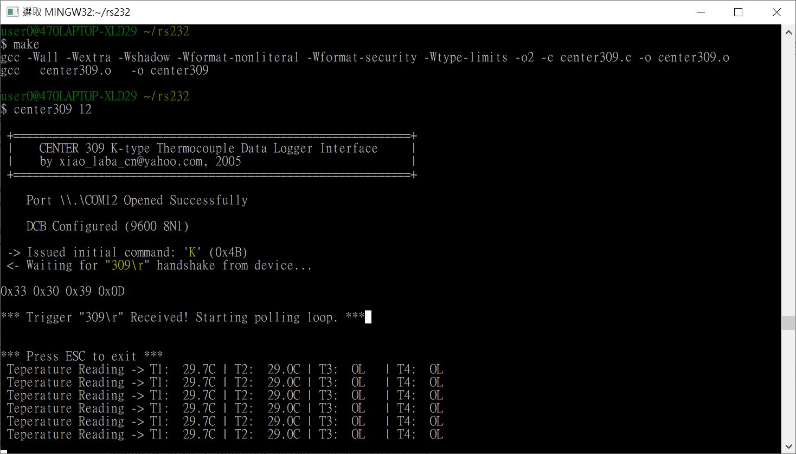
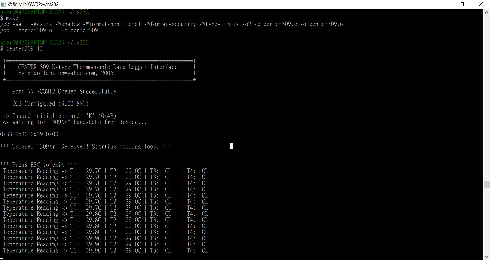

# center309_rs232_interface
old code, works ok for win32 (XP to win 11)

C source code, exe, build instruction, all in one  

  
  

### note
center309 and HH309 are just OEM item as the same stuff.   
[HH309.zip](HH309.zip) OEM software.  

### related projects
https://github.com/xiaolaba/HH309_logger_reader  
https://github.com/xiaolaba/artisan_kaleido_artisan-2.4.6  
https://github.com/xiaolaba/artisan  
